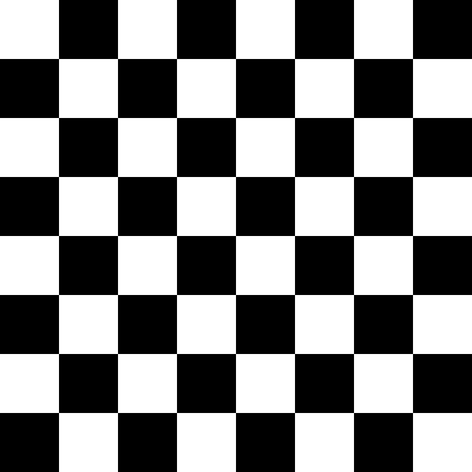
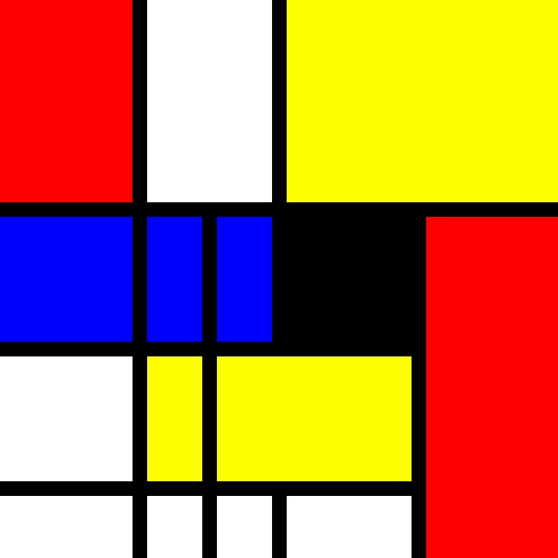
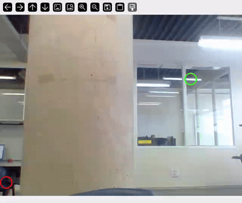
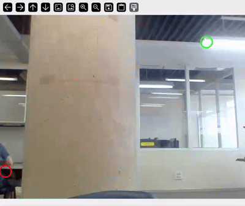
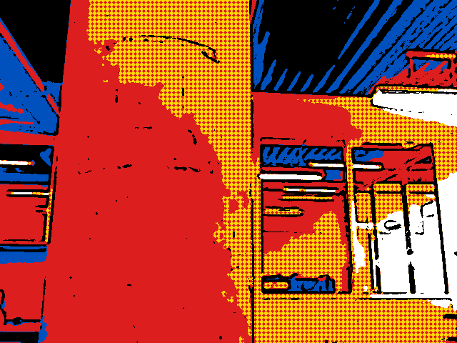

## Índice
- [Introducción](#introduccion)
- [Tarea 1](#tarea-1)
- [Tarea 2](#tarea-2)
- [Tarea 3](#tarea-3)
- [Tarea 4](#tarea-4)
- [Fuentes consultadas](#fuentes-consultadas)

## Introducción

En el cuaderno VC_P1 correspondiente a la primera práctica de la asignatura se proponen una serie de tareas que deben ser completadas. A continuación, se presenta una explicación de las distintas tareas propuestas y como se han resuelto para completarlas con éxito.

## Tarea 1

En el desarrollo de esta tarea se deberá conseguir generar una imagen de 800x800 píxeles con aspecto de tablero de ajedrez. 

Para ello, se genera la imagen del tablero de manera manual. A continuación, se muestra un fragmento del código utilizado para generar dicha imagen.

```
chess_img[0:100, 0:100, 0] = 255
chess_img[200:300, 0:100, 0] = 255
chess_img[400:500, 0:100, 0] = 255
chess_img[600:700, 0:100, 0] = 255

chess_img[100:200, 100:200, 0] = 255
chess_img[300:400, 100:200, 0] = 255
chess_img[500:600, 100:200, 0] = 255
chess_img[700:800, 100:200, 0] = 255

...

#Dimensiones
print(chess_img.shape)
#Visualiza con matplotlib (sin especificar el mapa de color gris)
plt.imshow(chess_img, cmap='gray') 
plt.show()
```

De esta forma, se obtiene una imagen como la que se observa a continuación.

<div align="center">



</div>


No obstante, se puede generar la imagen de manera más óptima haciendo uso de 2 bucles while anidados.

```
# Limpieza de la imagen
chess_img = np.zeros((alto,ancho,1), dtype = np.uint8)

i = 0
j = 0

while i < alto:
    while j <ancho:
        if (i//100 + j//100) % 2 == 0:
            chess_img[i:i+100, j:j+100, 0] = 255
        j += 100
    j = 0
    i += 100

#Dimensiones
print(chess_img.shape)
#Visualiza con matplotlib (sin especificar el mapa de color gris)
plt.imshow(chess_img, cmap='gray') 
plt.show()

# Guarda la imagen resultante a disco
cv2.imwrite('chess_img.jpg', chess_img)
```
 
 De esta forma, se obtendrá la misma imagen pero de una manera más simple y óptima.

<div align="center">

 

 </div>

## Tarea 2

En esta tarea se propone realizar una imagen inspirada en el estilo del pintor neerlandés [Piet Mondrian](https://historia.nationalgeographic.com.es/a/composicion-complejidad-basicas-obras-mondrian_22883). 

Para ello, se hará uso de las [primitivas](https://docs.opencv.org/4.13.0/dc/da5/tutorial_py_drawing_functions.html) que ofrece la biblioteca OpenCV. 

Con el presente código, se consigue generar la imagen estilo Mondrian solicitada para esta tarea.
```
# Crea una imagen con tres planos
mondrian_img = np.zeros((alto,ancho,3), dtype = np.uint8)

# Áreas de color
cv2.rectangle(mondrian_img,(0,0),(200, 300),(255,0,0),-1) # Rojo
cv2.rectangle(mondrian_img,(0,300),(400, 500),(0,0,255),-1) # Azul
cv2.rectangle(mondrian_img,(200,500),(600, 700),(255,255,0),-1) # Amarillo
cv2.rectangle(mondrian_img,(0,500),(200, 800),(255,255,255),-1) # Blanco
cv2.rectangle(mondrian_img,(200,700),(600, 800),(255,255,255),-1) # Blanco
cv2.rectangle(mondrian_img,(600,300),(800, 800),(255,0,0),-1) # Rojo
cv2.rectangle(mondrian_img,(200,0),(400, 300),(255,255,255),-1) # Blanco
cv2.rectangle(mondrian_img,(400,0),(800, 300),(255,255,0),-1) # Amarillo

# Separadores negros

# Horizontales
cv2.line(mondrian_img, (0,300), (800,300), (0,0,0), 20)
cv2.line(mondrian_img, (0,500), (600,500), (0,0,0), 20)
cv2.line(mondrian_img, (0,700), (600,700), (0,0,0), 20)

# Verticales
cv2.line(mondrian_img,(300,300),(300,800),(0,0,0),20)
cv2.line(mondrian_img,(400,700),(400,800),(0,0,0),20)
cv2.line(mondrian_img,(200,0),(200,800),(0,0,0),20)
cv2.line(mondrian_img,(600,300),(600,800),(0,0,0),20)
cv2.line(mondrian_img,(400,0),(400,500),(0,0,0),20)

# Visualiza la imagen resultante
plt.imshow(mondrian_img) 
plt.show()

# Guarda la imagen resultante a disco
cv2.imwrite('images/mondrian_img.jpg', cv2.cvtColor(mondrian_img, cv2.COLOR_RGB2BGR))
```

<div align="center">



</div>

## Tarea 3

Para la correcta compleción de la tarea propuesta, se propone dibujar un círculo sobre los píxeles más claro y oscuro captados por la cámara. Para ello, se hará uso de las funciones _minMaxLoc_ y de la primitiva _circle_.

```
vid = cv2.VideoCapture(0)

while True:      
    # fotograma a fotograma
    ret, frame = vid.read()
  
    # Hay nuevo fotograma
    if ret:
        # Se pasa a escala de grises
        grey_scale = cv2.cvtColor(frame, cv2.COLOR_BGR2GRAY)
        
        # Sacamos la posición del mínimo y la posición del máximo
        _, _, darkpos, lightpos = cv2.minMaxLoc(grey_scale)
        
        # Dibujamos los círculos sobre el fotograma actual, verde para el más claro y rojo para el más oscuro
        cv2.circle(frame, lightpos, 15, (0, 255, 0), 2)
        cv2.circle(frame, darkpos, 15, (0, 0, 255), 2)

        # Muestra fotograma
        cv2.imshow('Vid', frame)
    
    # Detenemos pulsado ESC
    if cv2.waitKey(20) == 27:
        break
  
# Libera el objeto de captura
vid.release()

# Destruye ventanas
cv2.destroyAllWindows()
```

<div align="center">



</div>

Sin embargo, esta propuesta no funciona de una manera muy fluida. Por ello, se hará uso de la función GaussianBlur para suavizar la imagen y que el dibujado de los círculos no se produzca tan a saltos.

``` 
vid = cv2.VideoCapture(0)
  
while True:      
    # fotograma a fotograma
    ret, frame = vid.read()
  
    # Hay nuevo fotograma
    if ret:
        # Se pasa a escala de grises
        grey_scale = cv2.cvtColor(frame, cv2.COLOR_BGR2GRAY) 
        
        # Suavizado para prevenir que el ruido de un píxel aislado no afecte al resultado
        grey_scale = cv2.GaussianBlur(grey_scale, (15, 15), 0)

        # Sacamos la posición del mínimo y la posición del máximo
        _, _, darkpos, lightpos = cv2.minMaxLoc(grey_scale)
        
        # Dibujamos los círculos sobre el fotograma actual, verde para el más claro y rojo para el más oscuro
        cv2.circle(frame, lightpos, 15, (0, 255, 0), 2)
        cv2.circle(frame, darkpos, 15, (0, 0, 255), 2)
        
        # Muestra fotograma
        cv2.imshow('Vid', frame)
    
    # Detenemos pulsado ESC
    if cv2.waitKey(20) == 27:
        break
  
# Libera el objeto de captura
vid.release()
# Destruye ventanas
cv2.destroyAllWindows()
```

<div align="center">



</div>

## Tarea 4

Como última tarea, se solicita una propuesta de Art Pop. Para ello y, tras investigar sobre artistas Art Pop reconocidos (Andy Warhol, Roy Lichtenstein, Keith Haring...) se ha optado por realizar una propuesta inspirada en el arte de Roy Lichtenstein y sus característicos _Ben-Day dots_.

Con el presente código, se ha conseguido simular la técnica que Lichtenstein aplicaba en sus obras.

```
vid = cv2.VideoCapture(0)

# Dimensiones de la cámara, a mitad de resolución
w = int(vid.get(cv2.CAP_PROP_FRAME_WIDTH))
h = int(vid.get(cv2.CAP_PROP_FRAME_HEIGHT))
vid.set(cv2.CAP_PROP_FRAME_WIDTH, w)  # En Mac no reacciona a estos comandos
vid.set(cv2.CAP_PROP_FRAME_HEIGHT, h)

# Paleta Lichtenstein (BGR): negro, azul, rojo, amarillo, blanco
paleta = np.array(
    [[0, 0, 0], [190, 80, 0], [30, 30, 220], [0, 215, 255], [255, 255, 255]],
    dtype=np.uint8,
)

# Trama de puntos Ben-Day (se calcula una sola vez)
celda = 6
yy, xx = np.mgrid[0:h, 0:w]
dist = np.hypot(xx % celda - celda / 2, yy % celda - celda / 2)
puntos = dist < celda * 0.35

while True:
    ret, frameIN = vid.read()

    if ret:
        # Tamaño único de salida (w x h)
        frame = cv2.resize(frameIN, (w, h), interpolation=cv2.INTER_NEAREST)

        # Luminosidad suavizada
        gris = cv2.medianBlur(cv2.cvtColor(frame, cv2.COLOR_BGR2GRAY), 5)

        # Cuantizamos la luminosidad en 5 bandas -> colores planos de la paleta
        bandas = np.digitize(gris, [50, 110, 170, 215])
        lich = paleta[bandas]

        # Puntos rojos sobre las zonas amarillas (tonos medios-claros)
        lich[(bandas == 3) & puntos] = paleta[2]

        # Contornos negros gruesos
        bordes = cv2.adaptiveThreshold(gris, 255, cv2.ADAPTIVE_THRESH_MEAN_C, cv2.THRESH_BINARY, 9, 4)
        lich[bordes == 0] = 0

        cv2.imshow("Lichtenstein", lich)

    # Detenemos pulsado ESC
    if cv2.waitKey(20) == 27:
        break

vid.release()
cv2.destroyAllWindows()
```

<div align="center">



</div>

Sin embargo, debido a nuestro conocimiento limitado sobre la técnica de Lichtenstein y desconocimiento acerca de como representarlos, se ha hecho uso de IA Generativa ([enlace a la conversación](https://claude.ai/share/0c0735ba-70f1-4550-820b-46b0a62a15e1)).

## Fuentes consultadas

- [Documentación de OpenCV](https://docs.opencv.org/4.13.0/d6/d00/tutorial_py_root.html)
- [Smoothing Images OpenCV](https://docs.opencv.org/4.13.0/d4/d13/tutorial_py_filtering.html)
- [Conversión de colores para guardar la imagen](https://stackoverflow.com/questions/42406338/why-cv2-imwrite-changes-the-color-of-pics)